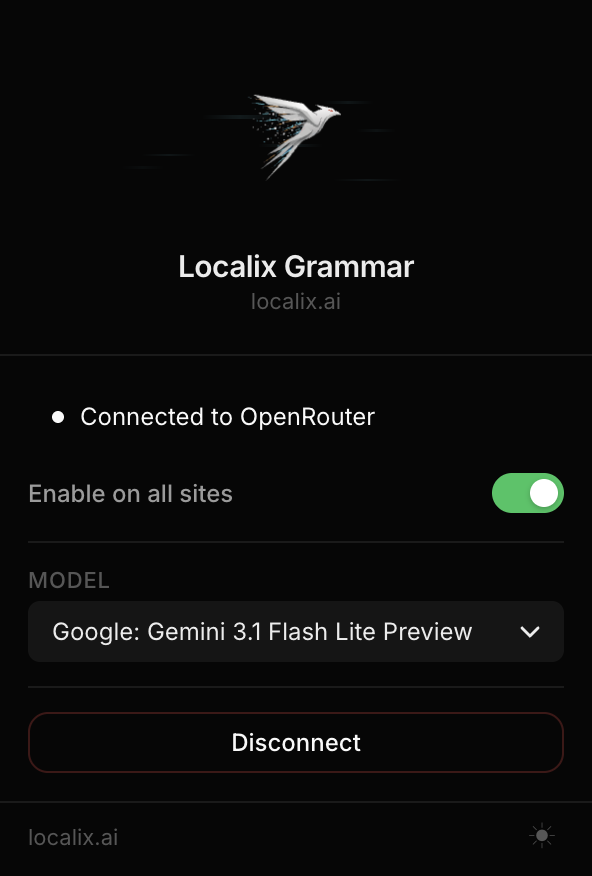

<p align="center">
  <a href="https://localix.ai/" target="_blank" rel="noopener noreferrer">
    
  </a>
</p>

<h1 align="center">Localix Grammar</h1>

<p align="center">
  AI-powered grammar, spelling, and style checker that works on every website —<br>
  one click to check, one click to fix, powered by any model on OpenRouter.
</p>

<p align="center">
  
  
  
  
</p>

---

<p align="center">
  
</p>

---

## What is Localix Grammar?

Localix Grammar is a lightweight Chrome extension that attaches a small trigger button to any text field or content-editable area on any website. Click it once to run an AI grammar and style check; click a highlighted fix to apply it instantly — no copy-pasting, no tab-switching.

It connects to [OpenRouter](https://openrouter.ai/) via OAuth, so there is no manual API key to manage. Pick any model from the OpenRouter catalogue, and the extension uses it for every check.

---

## Popup

<p align="center">
  
</p>

The popup shows your connection status, a global enable/disable toggle, and the active model. Click the model selector to search and switch to any model in the OpenRouter catalogue — sorted by newest first, with the default model always pinned at the top.

---

## Features

- **Works everywhere** — attaches to any `<input>`, `<textarea>`, or `contenteditable` on any website
- **Zero config** — authenticate once with OpenRouter via OAuth; no API keys to paste
- **One-click fix** — click a green-underlined word in the panel to apply the correction inline
- **Apply all** — fix every suggestion in the field with a single button
- **Model freedom** — pick from the full OpenRouter catalogue; default is `openai/gpt-5.4-mini`
- **Smart caching** — unchanged text is not re-checked; results are cached until you edit the field
- **Accurate positioning** — the suggestions panel always opens anchored to the trigger button, never jumps
- **Dark & light mode** — follows your system preference; toggle in the popup footer
- **Manifest v3** — fully compliant with current Chrome extension platform requirements

---

## How it works

```
focus any text field
        ↓
 trigger button appears (bottom-right corner of the field)
        ↓
       click
        ↓
 text is sent to OpenRouter → AI grammar check
        ↓
 suggestions panel opens — errors highlighted as clickable chips
        ↓
 click a chip → fix applied in-place, offsets recalculated
        ↓
 "Apply all" → all remaining fixes applied at once
```

---

## Installation

### From source (development)

```bash
git clone https://github.com/localixai/grammar-extension.git
cd grammar-extension
npm install
npm run build
```

Then load the `dist/` folder as an unpacked extension in Chrome:

1. Open `chrome://extensions`
2. Enable **Developer mode** (top right)
3. Click **Load unpacked**
4. Select the `dist/` folder

### Development watch mode

```bash
npm run dev   # vite build --watch — rebuilds on every file change
```

Reload the extension in `chrome://extensions` after each rebuild, or install the [Extensions Reloader](https://chrome.google.com/webstore/detail/extensions-reloader/fimgfedafeadlieiabdeeaodndnlbhid) helper.

---

## Configuration

All settings are stored in `chrome.storage.local` and persist across browser sessions.

| Setting | Default | Description |
| --- | --- | --- |
| `apiKey` | `""` | OpenRouter bearer token — set automatically via OAuth |
| `model` | `openai/gpt-5.4-mini` | Model used for every grammar check |
| `enabled` | `true` | Global on/off — disables the trigger button on all sites when false |

---

## Project structure

```
extension/
├── src/
│   ├── background/          # Service worker
│   │   ├── index.ts         # Message router (CHECK_TEXT, FETCH_MODELS, …)
│   │   ├── grammar-service.ts  # OpenRouter chat completion call
│   │   └── models-service.ts   # /api/v1/models fetch + 10-min cache
│   ├── content/             # Content script (injected into every page)
│   │   ├── index.ts         # MutationObserver — attaches FieldController to inputs
│   │   ├── field-controller.ts  # Per-field state machine
│   │   ├── trigger-button.ts    # Floating check button
│   │   ├── suggestions-panel.ts # Grammar suggestions overlay
│   │   ├── apply.ts             # Replacement logic (input / textarea / contenteditable)
│   │   └── input-detector.ts    # Detects and reads supported element types
│   ├── popup/               # Extension popup
│   │   ├── index.html       # UI + embedded styles
│   │   └── index.ts         # Settings, OAuth flow, model picker
│   └── shared/
│       ├── types.ts          # Shared types & message contracts
│       └── utils/
│           ├── storage.ts        # chrome.storage helpers
│           └── openrouter-auth.ts  # OAuth PKCE flow
├── public/                  # Static assets (icons, logos)
├── assets/                  # Screenshots for README
├── manifest.json
├── vite.config.ts
└── tsconfig.json
```

---

## Tech stack

| Layer | Technology |
| --- | --- |
| Language | TypeScript (strict) |
| Build | Vite 8 — popup as ES module bundle, content & background as standalone IIFEs |
| Extension platform | Manifest v3, Chrome |
| AI | OpenRouter `/api/v1/chat/completions` |
| Auth | OpenRouter OAuth 2.0 PKCE via `chrome.identity` |
| Storage | `chrome.storage.local` |
| Styling | Vanilla CSS custom properties — no framework |

---

## Development

```bash
npm run build       # production build → dist/
npm run dev         # watch mode
npm run lint        # eslint src/
npm run format      # prettier --write src/
```

TypeScript is configured in strict mode. The background script and content script are compiled as self-contained IIFE bundles to avoid ES module / service worker conflicts.

---

## License

MIT — see [LICENSE](LICENSE).

---

<p align="center">
  Built by <a href="https://localix.ai">Localix</a> · <a href="https://localix.ai">localix.ai</a>
</p>
